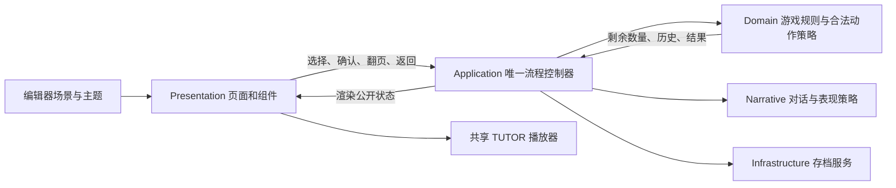

# PROJECT MIRROR Demo 架构

更新：2026-09-05。本目录只维护当前可玩的 Godot 4.7.1 / .NET 8 demo。

## 入口与目录

打开 `project.godot`，主场景为 `scenes/main.tscn`。`DEMO.csproj` 只编译 `scripts/**/*.cs`；工具、验证代码和导出包不会被递归编入游戏。

```text
demo/
├─ scenes/
│  ├─ main.tscn                  背景、三个页面、音频通道、切换遮罩
│  └─ ui/                       TitleScreen / GameplayHUD / TutorDialogueUI
├─ scripts/
│  ├─ Application/              唯一流程控制器，按职责拆分 partial 文件
│  ├─ Domain/                   纯 C# 规则、合法动作策略、会话与快照
│  ├─ Narrative/                对话库、语音目录、表情与语音优先级策略
│  ├─ Infrastructure/           JSON 读取、规则配置、原子存档服务
│  └─ Presentation/
│     ├─ Screens/               页面绑定、玩家输入、数据展示
│     ├─ Components/            头像、轨道局面、引导与按钮状态
│     ├─ Effects/               背景动画、边框拖尾、页面切换
│     └─ Audio/                 TUTOR / BGM / UI 音效
├─ data/                        已实现的对白与两种游戏规则
├─ assets/                      游戏使用的图像、音效、197 条语音目录记录
├─ themes/                      蓝色主题、标题点阵、头像眼部异常材质
├─ shaders/                     当前场景引用的着色器
├─ tests/FormalDemo/            独立规则验证和 Godot 功能验证场景
├─ tools/                      本地资源制作与导出辅助工具
├─ _qa/                        本地运行记录、截图、改造辅助脚本
├─ _export_tools/              本地 Godot 导出依赖
└─ _release/                   Windows 发行包与校验文件，本次版本 v0.1.4
```

`_qa`、`_export_tools`、`_release` 是明确的开发产物目录，不是未来功能模块。发布导出排除开发辅助内容。

## 职责与数据方向



- `DemoFlowController.cs`：入口绑定、页面切换、输入路由、结果后的阶段推进。
- `DemoFlowController.Bash.cs`：Bash 开局、双方行动的动画时序、结算。
- `DemoFlowController.LimitBash.cs`：玩家锁定、合法 TUTOR 决策、揭示、共同执行与结算。
- `DemoFlowController.Narrative.cs`：剧情页、局前介绍、随机台词、去重、选择反馈和犹豫提示。
- `DemoFlowController.Persistence.cs`：快照构造、恢复、存档失败处理、累计游玩时间。

这些 partial 文件组成**同一个控制器实例**，没有额外的流程控制节点。`_flowVersion` 使切换页面或读档前启动的异步行动失效，避免旧计时器修改新一局。

`BashGame`、`LimitBashGame` 判定合法动作和胜负；`StrategyEngine`、`OutcomeDirector` 选择合法的 TUTOR 行动。UI 不判定胜负，不直接修改存档。叙事随机选择不消耗游戏规则使用的随机数序列。

## 玩家界面

对局页分为三列：左侧规则和 TUTOR，中央局面、选择和对白，右侧选择历史与 SAVE & BACK。

保留当前回合归属、剩余锚点、已选操作、关键规则、双方历史和结果。移除了游玩计时、内部状态描述、总动作统计、胜场目标和连续平局目标。累计游玩时间和结束条件仍留在会话逻辑中，以保证规则与存档行为正确。

`GameplayHUD.cs` 负责场景绑定、输入和局面渲染；`GameplayHUD.Presentation.cs` 负责字幕、声音协调、结算与揭示动画。右侧历史源于规则对象，不再使用临时系统提示拼接历史。

### 在编辑器中修改的位置

| 修改内容 | 资源 / Inspector 位置 |
|---|---|
| 背景和默认 BGM | `main.tscn` → `Background.texture` / `BackgroundMusicPlayer.stream` |
| UI 音效和音量 | `main.tscn` → `UiAudioController` 的导出音效字段与三个子播放器 |
| 对局布局、字号、分区尺寸 | `GameplayHUD.tscn` → `SafeArea/Layout` 下的 Container 和控件 |
| 左侧简要规则 | `GameplayHUD.tscn` 根节点的 `BashRules` / `LimitRules` |
| 主颜色、通用字体与玻璃底色 | `themes/ProjectMirrorBlueTheme.tres` |
| 按钮普通 / 悬停 / 选中 / 禁用状态 | `GameplayHUD.tscn` 内的 StyleBox 资源和按钮 Theme Overrides |
| TUTOR / S-17 默认头像 | `TutorDialogueUI.tscn` 根节点的 `TutorPortrait` / `S17Portrait` |
| 头像图集与动画参数 | `PortraitTexture` → `AtlasSource`、`Columns`、`Rows`、帧率和悬浮参数 |
| 头像圆框 | `PortraitFrame` → `RingColor`、`RingWidth`、`GlowWidth` |
| 局面核心图与各状态颜色 | `LatticeView` → `EnergyCoreTexture` 和导出颜色字段 |
| 边框拖尾速度、颜色与强度 | 各面板的 `ParticleFrame.material` → `speed`、`particle_color` |
| 标题点阵效果 | `themes/DotMatrixTextMaterial.tres` 及对应 shader |
| TUTOR 普通提示间隔 | `main.tscn` → `TutorSpeechPlayer.StandardSpeechGapSeconds` |

代码不再根据固定文件路径覆盖背景、头像、核心图片和 UI 音效。`FrameDisplay`、锁定图标和 `ParticleFrame` 都是场景中可见的节点；删除了全树自动注入文字和边框的安装器。

**允许在代码内计算的例外**：图集动画的当前帧与视觉中心、随父控件尺寸更新的 shader 几何参数、引导箭头对目标按钮的追踪、局面轨道绘制，以及相对场景初始位置的过渡动画。这些是运行时效果，不是默认布局坐标。圆形头像只由 `SmoothPortraitFrame` 绘制一个边框，不叠加通用矩形拖尾。

正文和按钮使用原生字形，24–34 px 为主要文字范围；正文不受点阵 shader 调暗。标题保留轻微点阵，覆盖率下限为 0.92，亮度为 1.0。边框 `speed` 从 0.16 调为 0.04，即一周约 25 秒；粒子透明度现在确实控制强度。

## 语音与字幕

复用现有本地录音与 `assets/audio/tutor/manifest.json`，没有更换声线，也没有合成新的音频文件。

- 剧情、规则、局前介绍、确认解释、正式揭示和结算属于 `Essential`。
- 选择、修改选择、犹豫、TUTOR 行动后、接近终局和揭示后反馈改为 `Standard`，由播放器检查播放状态与 2.5 秒起播间隔。
- 首次选择触发反馈的比例从 35% 调到 65%，同一回合限制首次选择 / 修改 / 犹豫各一次，并避开最近的台词。
- 描述“双方选择相同”的录音只在实际揭示值相同时进入候选池，避免语音与历史记录矛盾。
- 正在播放时不允许普通提示打断。HUD 暂存最新一条相关反馈，空闲后同步显示字幕并播放；确认、结果或页面离开会清掉过期提示。
- 玩家请求锁定期间继续保持安静，随后由明确的揭示解释接管。S-17 保持无语音。
- 全场只有一个 TUTOR 播放器。BGM 使用独立 Music 总线，TUTOR 开口时降低音量。

## 存档与历史

存档仍为 schema 3，保留原有校验和、原子写入和恢复机制。本次没有新增顶层存档字段。

`GameSnapshot.ChoicePairs` 承载当前一局的有序历史：Limit Bash 一条记录包含双方选择；Bash 每条记录只包含当前行动方的数字，未行动一方为 0。`BashGame.History` 随新局清空，行动后追加，读档时恢复。旧版本 Bash 存档没有记录历史，无法反推缺失的动作；可以恢复局面，之后继续积累新历史。

`ChoicePair.IsDifferent` / `LargerActor` 仅用于 Limit Bash 的比较规则，Bash 的历史展示不依赖这两个属性。

## 清理与验证

未使用的 `Meta`、`Dialogue`、`assets/bg`、`assets/fonts`、`data/config` 等目录，以及迁移后为空的旧代码目录已移出 demo。旧 MilestoneA 构建缓存、已停用的分隔线 shader / 材质、依赖旧绿色文字注入布局的 `FormalDemoSmoke` 已归档到工程内：

`../.codex-work/retired-demo-20260905/`

新的 `UiRefinementSmoke` 取代旧版视觉断言；原有规则验证、完整流程验证、语音验证与头像验证仍保留。相关引用随目录迁移更新。旧截图与发布包仅作为历史记录，不代表当前界面。

按用户追加的打包与 GitHub 发布要求，本次执行 Release 构建、规则验证、资源扫描、UI / 语音 / 头像验证及从标题到结算的完整流程回归。主要入口如下：

```powershell
dotnet build DEMO.csproj --configuration Release
dotnet run --project tests/FormalDemo/FormalDemo.csproj --configuration Release
& '..\Godot_v4.7.1-stable_mono_win64\Godot_v4.7.1-stable_mono_win64_console.exe' `
  --path . --rendering-method gl_compatibility --resolution 1920x1080 `
  res://tests/FormalDemo/UiRefinementSmoke.tscn
```

验证范围：单层头像、删除冗余节点、后续 Bash / Limit 语音、避免语音打断、两种历史的生成和恢复、正文及规则不截断，以及 1920×1080 视口边界。验证使用 `.godot/tests/ui_refinement_save.json`，不覆盖玩家正式存档。截图和日志位于 `_qa/ui-refinement/` 与 `_qa/ui-refinement-run.log`。

v0.1.4 验证结果：Release 构建零警告 / 零错误，1086 项领域断言通过，UI、语音、头像与完整流程验证通过。UI 分别使用 OpenGL 和默认 D3D12 运行；完整流程完成最终 SUMMARY 并返回标题。

发行包包含 487 个 PCK 资源、190 个运行文件，已检查排除测试、编辑器缓存和玩家进度，且解压副本逐文件校验一致。独立解压目录中的 Windows EXE 分别以 D3D12 和 OpenGL 启动，均以 0 退出且无警告 / 错误；玩家原有存档校验值保持不变。`FullFlowSmoke` 保留正式语音和动画速度，等待上限覆盖多局流程，不通过游戏内的快速模式跳过演出。
